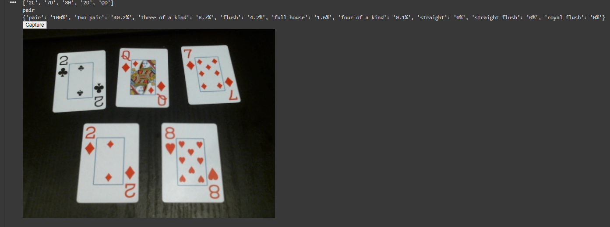
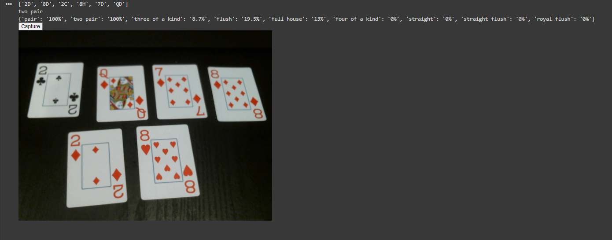
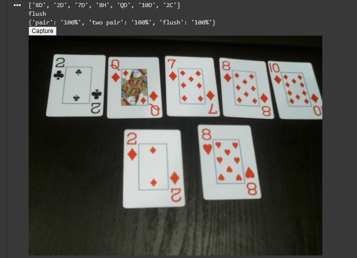

# poker-cv

This is a computer vision project that can detect the hand someone has and identify what the hand is (high card, pair, two pair, three of a kind, etc.)

Additionally, it can calculate the odds of you picking up other hands. For example, if you have a pair on the flop, what are the odds you pick up a three-of-a-kind?

The program can also determine what hands are impossible to obtain. For example, if the river is shown and you only have a pair, it would be impossible to get a four-of-a-kind, and the program will report that.

The program utilizes a YoloV8 model to perform card detection. This model was trained, tested, and validated using a dataset of playing cards which I annotated myself using Roboflow's annotation software. The cards are identified in a format that includes the letter or number featured on their card along with the first letter of their suit. For example, the eight of hearts is '8H' and the queen of diamonds is 'QD'.

### Layout of Results
```
[Cards Identified]
"Best Hand"
{'Hand':'Odds', 'Hand':'Odds'}
```

### Example of the model on the flop



### Example of the model on the turn



### Example of the model on the river


